# Baza danych smart-railwaysys

## 1. Szkielet grafu

### Wszystkie etykiety węzłów oraz ich liczba

```sql
MATCH (n) RETURN labels(n) AS etykieta, count(*) AS liczba ORDER BY liczba DESC;
```

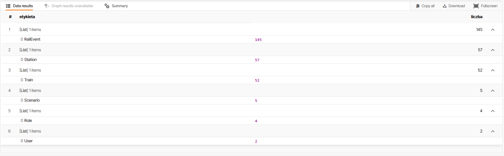

### Typy relacji wraz z ich ilością

```sql
MATCH ()-[r]->() RETURN type(r) AS relacja, count(*) AS liczba ORDER BY liczba DESC;
```

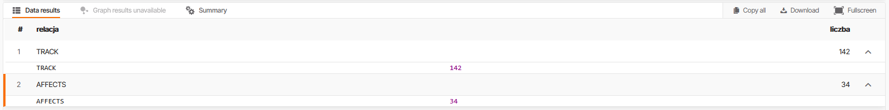

### Węzły bez etykiet (brak)

```sql
MATCH (n) WHERE size(labels(n)) = 0 RETURN n LIMIT 25;
```

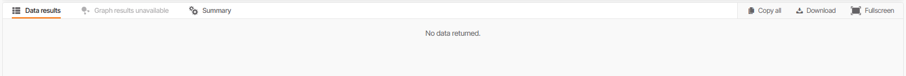

### Ogólne statystyki magazynu (Specyfikacja memgraph)

```sql
SHOW STORAGE INFO;
```

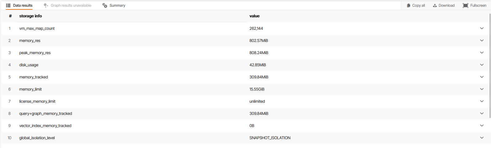
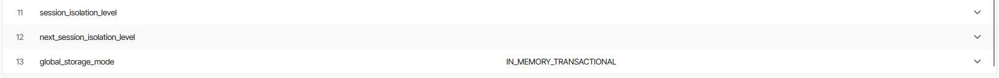

## 2. Automatyczne wykrywanie schematu (za pomocą modułu MAGE schema)

Obraz aplikacji/bazy danych to memgraph-mage, który wypisuje wszystkie właściwości na każdą z etykiety lub relacji wraz z ich typami:

```sql
CALL schema.node_type_properties() YIELD nodeType, propertyName, propertyTypes
```

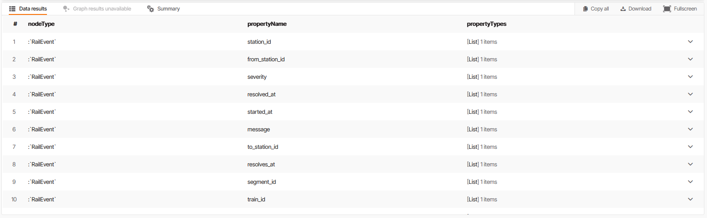
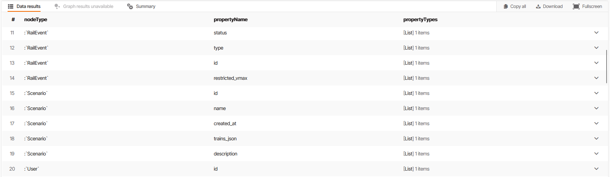
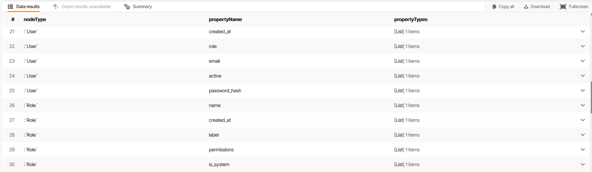
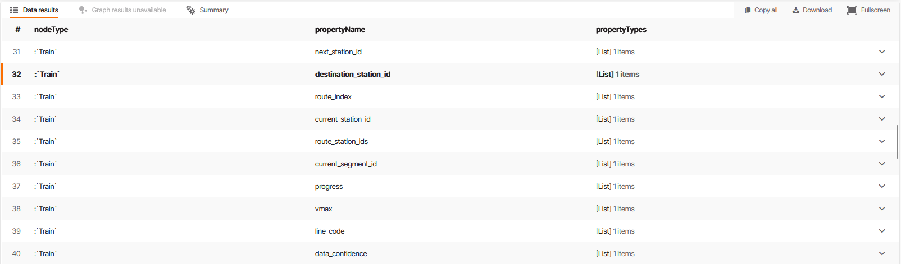
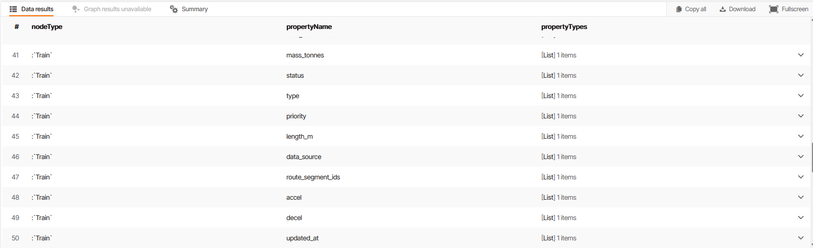
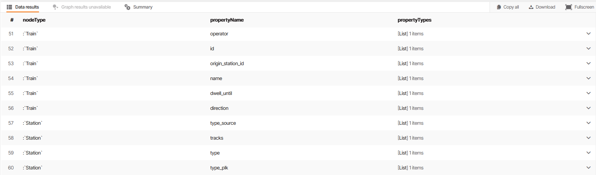
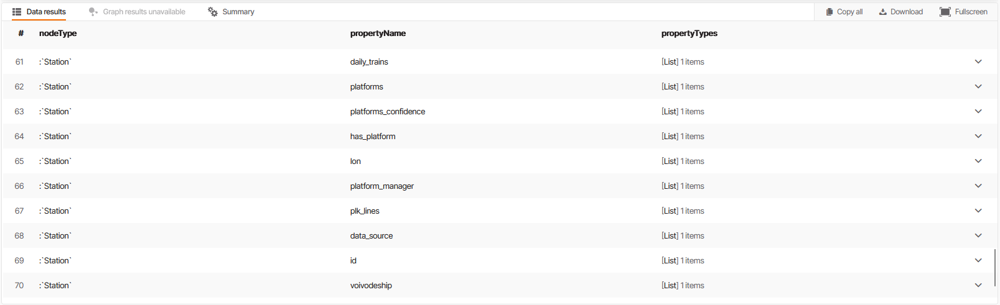
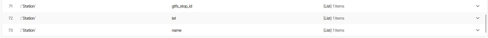

```sql
CALL schema.rel_type_properties() YIELD relType, propertyName
```

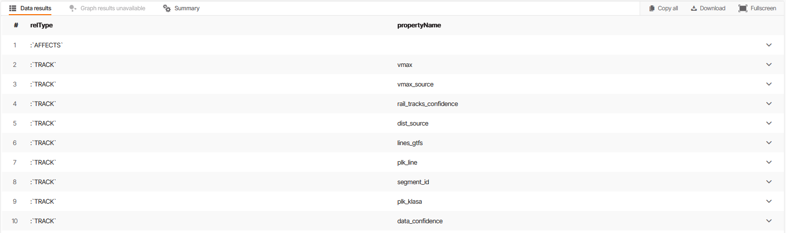
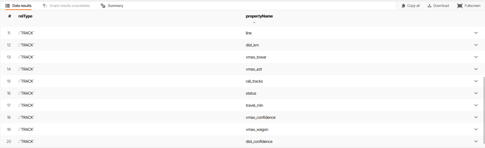

## 3. Indeksy

```sql
SHOW INDEX INFO;
```

```sql
SHOW CONSTRAINT INFO
```

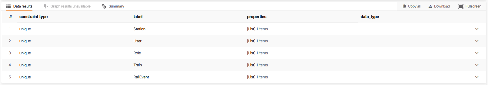

```sql
SHOW TRIGGERS
```

## 4. Węzły stacji

### Węzeł z wszystkimi polami

```sql
MATCH (s:Station) RETURN s LIMIT 1;
```

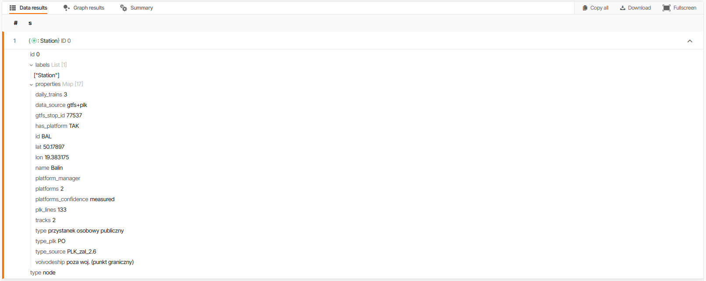
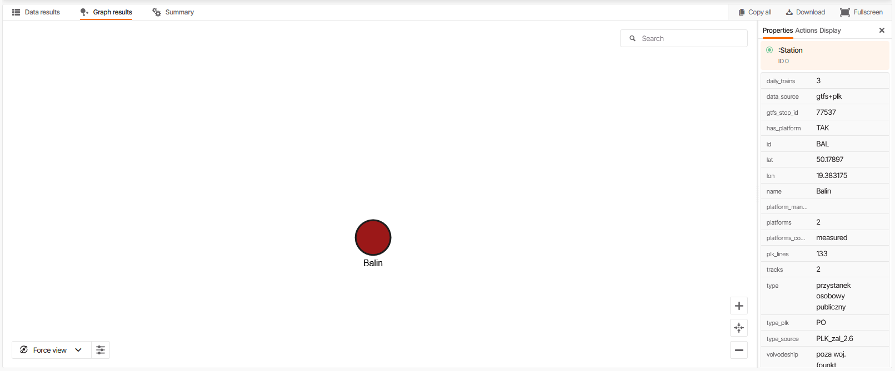

### Rozkład typ: Posterunek

```sql
MATCH (s:Station) RETURN s.type, count(*) AS liczba ORDER BY liczba DESC;
```

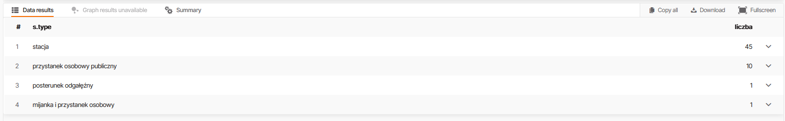

### Rozkład stacji według województwa

```sql
MATCH (s:Station) RETURN s.voivodeship, count(*) AS liczba ORDER BY liczba DESC;
```

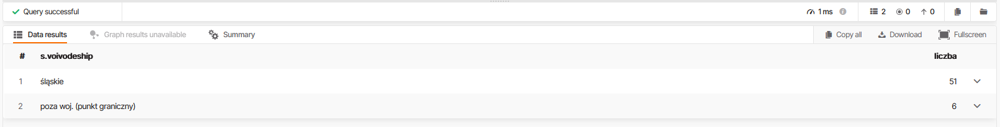

### Kontrola jakości, szukanie braków w polach

```sql
MATCH (s:Station)
WHERE s.lat IS NULL OR s.lon IS NULL OR s.platforms IS NULL
RETURN s.id, s.name;
```

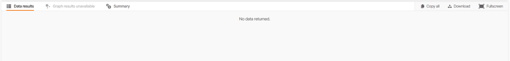

### Kontrola jakości, duplikaty ID

```sql
MATCH (s:Station) WITH s.id AS id, count(*) AS c WHERE c > 1 RETURN id, c;
```

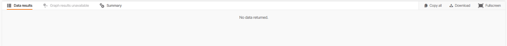

## 5. Relacje odcinkowe

Każdy fizyczny odcinek to dwie skierowane relacje, dzielące segment_id. Dowód:

### Przykładowa relacja ze wszystkimi polami

```sql
MATCH (:Station)-[t:TRACK]->(:Station) RETURN t LIMIT 1;
```


### Sprawdzenie: ile unikalnych segment_id a ile relacji TRACK?

```sql
MATCH ()-[t:TRACK]->() RETURN count(DISTINCT t.segment_id) AS unikalne_segmenty, count(t) AS relacje;
```

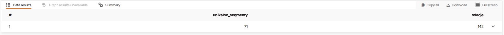

✅ Zgadza się, TACK to dwukrotność segment_id

### Czy każdy segment_id ma 2 relacje?

```sql
MATCH ()-[t:TRACK]->()
WITH t.segment_id AS seg, count(*) AS c
WHERE c <> 2
RETURN seg, c;
```

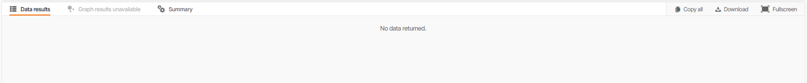

(gdyby klauzula `WHERE` była z trudna 👇)

```sql
MATCH ()-[t:TRACK]->()
WITH t.segment_id AS seg, count(*) AS c
RETURN seg, c;
```

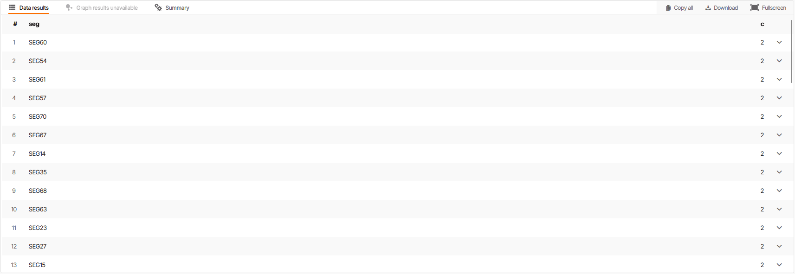

✅ Zgadza się, segment_id ma 2 relacje

### Czy oba kierunki tego samego segmentu mają spójne parametry (dist_km, vmax, rail_tracks)?

```sql
MATCH ()-[t:TRACK]->()
WITH t.segment_id AS seg,
     collect(DISTINCT t.dist_km) AS dists,
     collect(DISTINCT t.vmax) AS vmaxes,
     collect(DISTINCT t.rail_tracks) AS tory
WHERE size(dists) > 1 OR size(vmaxes) > 1 OR size(tory) > 1
RETURN seg, dists, vmaxes, tory;
```


(bez `WHERE` 👇)

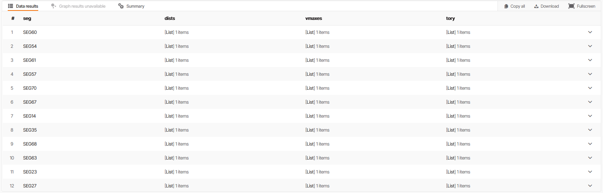

### Suma długość całej sieci (dzieląc przez 2, bo każdy odcinek liczony w obie strony)

```sql
MATCH ()-[t:TRACK]->() RETURN sum(t.dist_km) / 2 AS suma_km;
```

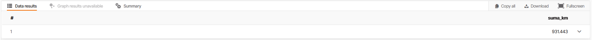

### Odcinki wg statusu (active / blocked / restricted)

```sql
MATCH ()-[t:TRACK]->() RETURN t.status, count(*) AS liczba ORDER BY liczba DESC;
```

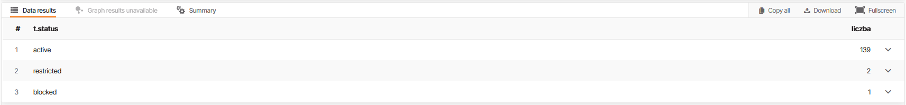

### Odcinki bez potwierdzonego pomiaru PLK (brak zmierzonej prędkości ze źródła)

```sql
MATCH ()-[t:TRACK]->() WHERE t.vmax_confidence <> 'measured' RETURN t.segment_id, t.vmax_confidence;
```

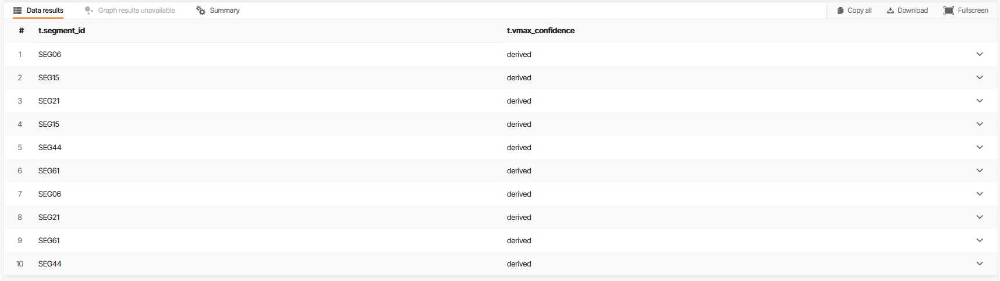

### Stopień węzła: ile odcinków wychodzi z danej stacji / szuka rozgałęzień i węzłów końcowych

```sql
MATCH (s:Station)
OPTIONAL MATCH (s)-[t:TRACK]->()
RETURN s.id, s.name, count(DISTINCT t.segment_id) AS liczba_odcinkow
ORDER BY liczba_odcinkow;
```

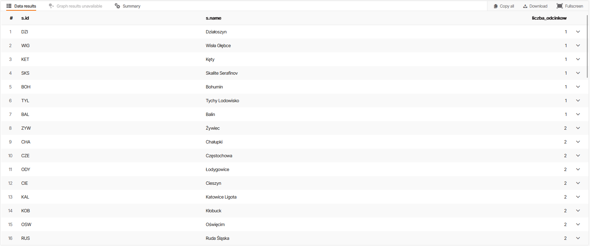
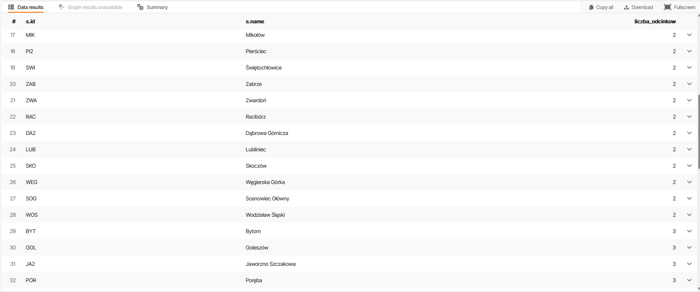
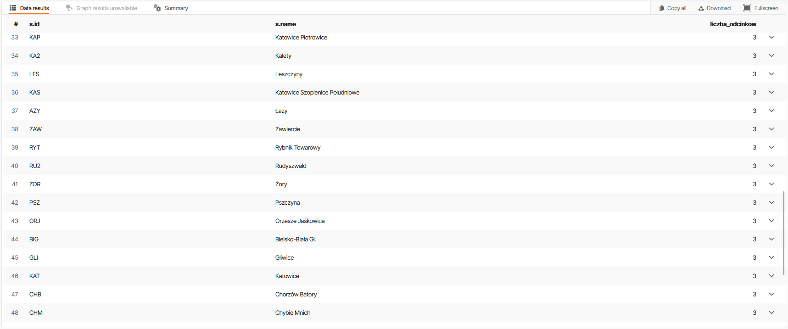
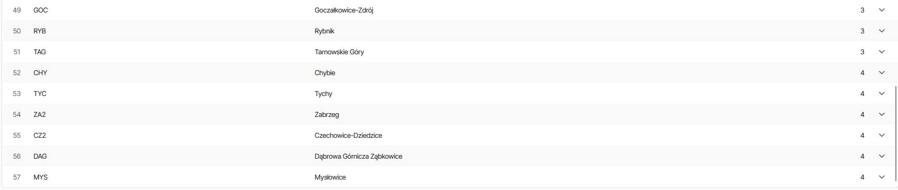

### Stacje bez żadnego połączenia (błąd w danych)

```sql
MATCH (s:Station) WHERE NOT (s)-[:TRACK]-() RETURN s.id, s.name;
```

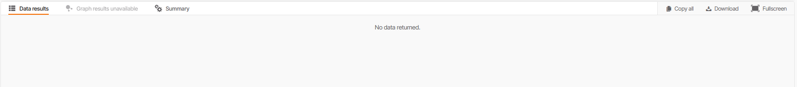

✅ Brak błędu

### Spójność grafu — czy da się dojść z dowolnej stacji do każdej innej (BFS, moduł MAGE)

```sql
MATCH (a:Station {id:'KAT'})-[:TRACK *BFS]->(b:Station)
RETURN count(DISTINCT b) AS osiagalne;
```

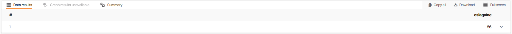

## 6. Węzły Train

### Przykładowy węzeł ze wszystkimi polami

```sql
MATCH (t:Train) RETURN t LIMIT 1;
```

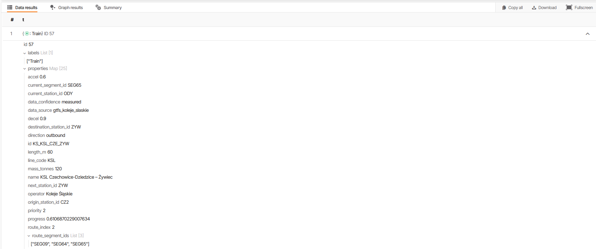
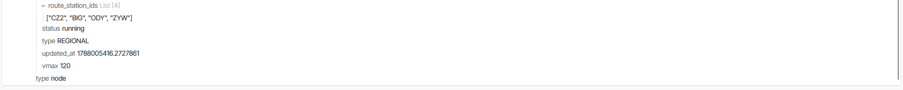
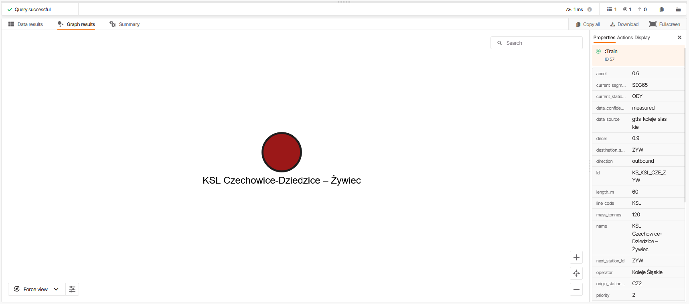
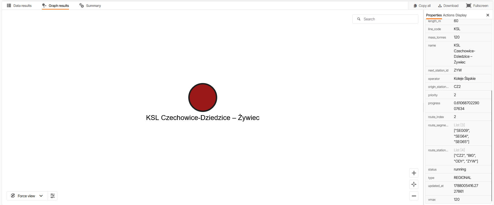

### Rozkład statusów pociągów w danym momencie

```sql
MATCH (t:Train) RETURN t.status, count(*) AS liczba ORDER BY liczba DESC;
```

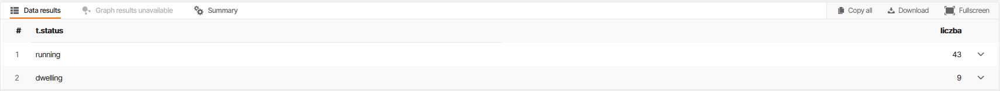

### Rozkład wg typu operatora

```sql
MATCH (t:Train) RETURN t.type, t.operator, count(*) AS liczba ORDER BY liczba DESC;
```

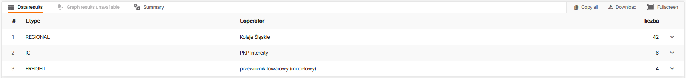

### Pociągi z origin/destination wskazującym na nieistniejącą stację (integralność referencyjna)

```sql
MATCH (t:Train)
WHERE NOT EXISTS { MATCH (s:Station {id: t.origin_station_id}) }
   OR NOT EXISTS { MATCH (s:Station {id: t.destination_station_id}) }
RETURN t.id, t.origin_station_id, t.destination_station_id;
```

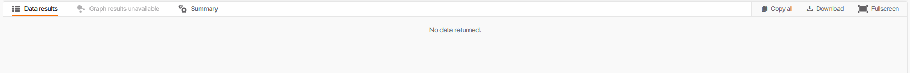

### Pociągi aktualnie opóźnione przez zdarzenie

```sql
MATCH (t:Train) WHERE t.delayed_by_event_id IS NOT NULL RETURN t.id, t.status, t.delayed_by_event_id;
```

## 7. Węzły RailEvent + relacja AFFECTS

### Przykładowy węzeł ze wszystkimi polami

```sql
MATCH (e:RailEvent) RETURN e LIMIT 1;
```

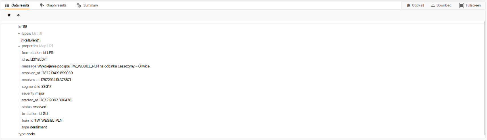

### Rozkład typów zdarzeń

```sql
MATCH (e:RailEvent) RETURN e.type, count(*) AS liczba ORDER BY liczba DESC;
```

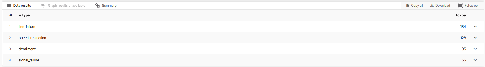

### Relacja AFFECTS — przykład i to, co jest dotknięte zdarzeniem

```sql
MATCH (e:RailEvent)-[a:AFFECTS]->(x) RETURN e.id, type(a), labels(x), x LIMIT 25;
```

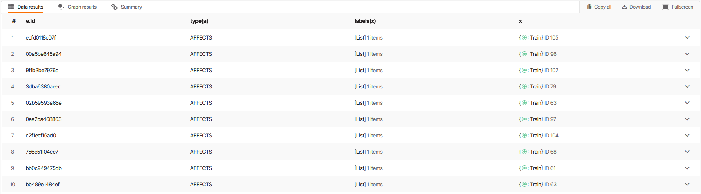
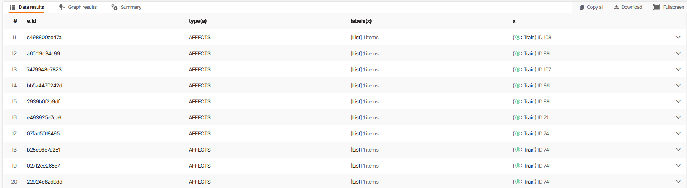
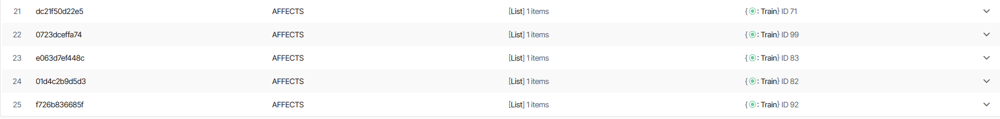

### Zdarzenia wskazujące na nieistniejący pociąg (integralność referencyjna)

```sql
MATCH (e:RailEvent)
WHERE e.train_id IS NOT NULL AND NOT EXISTS { MATCH (t:Train {id: e.train_id}) }
RETURN e.id, e.type, e.segment_id, e.station_id, e.train_id;
```

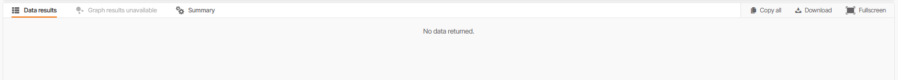

## 8. Węzły User i Role

Uwaga na szczegół architektoniczny: nie ma relacji grafowej między User a Role — User.role to zwykły string, który powinien odpowiadać Role.name. To warto jawnie zapisać w dokumentacji, bo różni się od reszty modelu (który jest relacyjny/grafowy).

```sql
MATCH (u:User) RETURN u.id, u.email, u.role, u.active, u.created_at;
```

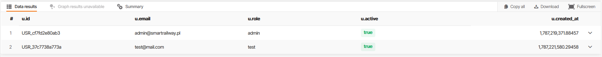

```sql
MATCH (r:Role) RETURN r.name, r.label, r.permissions, r.is_system;
```

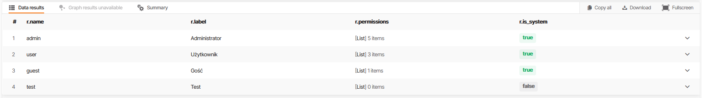

### Integralność: czy każdy User.role wskazuje na istniejącą Role.name?

```sql
MATCH (u:User)
WHERE NOT EXISTS { MATCH (r:Role {name: u.role}) }
RETURN u.id, u.email, u.role;
```

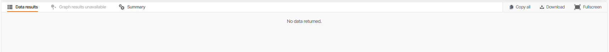

## 9. Property keys użyte w całej bazie

### Sprawdzanie literówek

```sql
MATCH (n) UNWIND keys(n) AS k RETURN DISTINCT k ORDER BY k;
```

```sql
MATCH ()-[r]->() UNWIND keys(r) AS k RETURN DISTINCT k ORDER BY k;
```

### 10. Statystyki do weryfikacji dokumentacji

57 stacji / 71 odcinków / 52 pociągi

```sql
MATCH (s:Station) RETURN count(s);
```

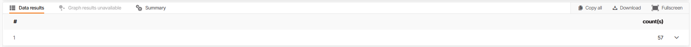

```sql
MATCH ()-[t:TRACK]->() RETURN count(DISTINCT t.segment_id);
```

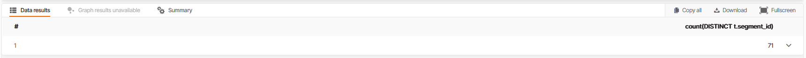

```sql
MATCH (t:Train) RETURN count(t);
```

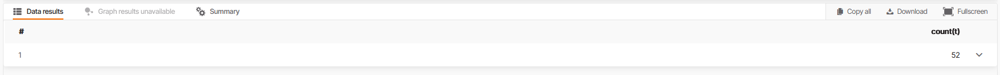

## 11. Wizualizacja

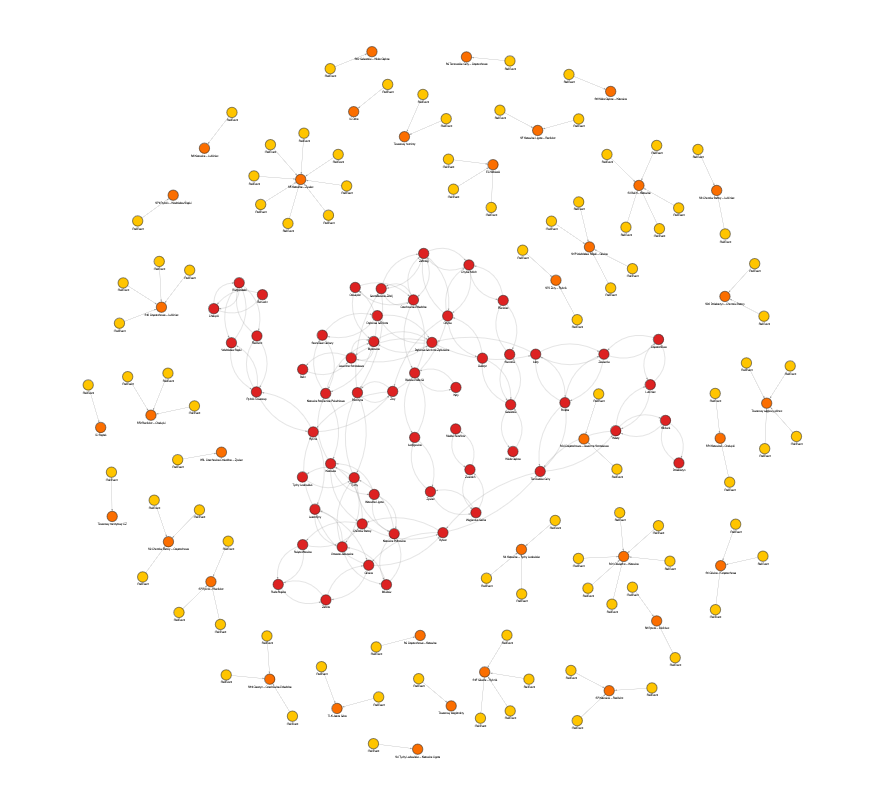

### Tylko sieć torowa (bez pociągów/eventów/userów) — czytelniejszy graf

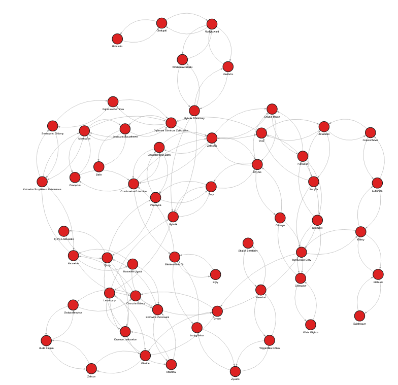
